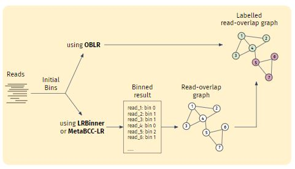
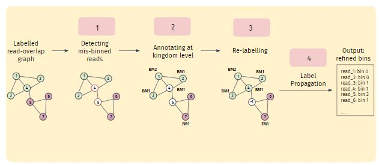

[comment]: # "This is the standard layout for the project, but you can clean this and use your own template"

# Long-reads Binning For Microbial Metagenomics Considering Multi-kingdoms

#### Team

- E/18/030, Aththanayaka A.M.S., [e18030@pdn.ac.lk](mailto:name@email.com)
- E/18/282, Ranasinghe R.A.N.S., [e18282@pdn.ac.lk](mailto:name@email.com)
- E/18/283, Ranasinghe R.D.J.M., [e18283@pdn.ac.lk](mailto:name@email.com)

#### Supervisors

- Dr. Damayanthi Herath, [damayanthiherath@eng.pdn.ac.lk](mailto:name@eng.pdn.ac.lk)
- Dr. Vijini Mallawarachchi, [vijini.mallawaarachchi@flinders.edu.au](mailto:name@eng.pdn.ac.lk)

#### Table of content

1. [Abstract](#abstract)
2. [Background](#background)
3. [Related works](#related-works)
4. [Methodology](#methodology)
5. [Experiment Setup and Implementation](#experiment-setup-and-implementation)
6. [Results and Analysis](#results-and-analysis)
7. [Conclusion](#conclusion)
8. [Publications](#publications)
9. [Links](#links)

## Abstract

DNA metagenomics, which analyzes the entire genetic pool of an environmental sample, offers powerful insights into microbial communities. Traditionally, short-read sequencing technology dominated metagenomic analysis. As sequencing technology advanced, long-read sequencing emerged, generating significantly longer reads. Then several binning tools have developed enabling reconstruction of more complete genomes. Most of these tools have used coverage and composition features for binning procedure and have achieved good accuracy. 

This research introduces [G11 refiner], a novel long-read binning refiner designed to address further additional read features like kingdom level information of microorganisms to enhance the accuracy and work along with long read binning tools like OBLR, MetaBCC-LR. By incorporating these advancements, [G11 refiner] aims to significantly improve the accuracy and efficiency of binning long-reads by using multi-kingdom data. 

## Background 

  

Our planet harbors a hidden universe teeming with life forms invisible to the naked eye – microorganisms. These diverse single-celled organisms, including bacteria, archaea, protists, and fungi, exist in a multitude of environments, from the scorching deserts to the frigid depths of the oceans. Despite their minute size, microorganisms play a critical role in the intricate tapestry of life on Earth.

Every living organism, from towering trees to microscopic bacteria, is built from fundamental units called cells. These microscopic marvels serve a dual purpose: providing structure and carrying out the essential chemical reactions that sustain life. Tucked away within the cell's nucleus lies the blueprint for the entire organism – its genome. This blueprint dictates everything from physical appearance to specialized functions.

The genome itself is meticulously organized into thread-like structures called chromosomes, composed of DNA and proteins. DNA, the molecule of heredity, boasts a unique double helix structure. Each rung of this ladder is formed by a pair of molecules called nucleotides, identified by specific letters: A, C, G, and T. The specific sequence of these nucleotides along the DNA strand acts as a coded message that dictates the production of proteins, the workhorses of the cell. These proteins perform a multitude of tasks, ensuring the proper functioning of the organism. Genes, discrete segments along the DNA strand, house the instructions for specific proteins or functional RNA molecules. These genes are the cornerstone of heredity, faithfully passing traits from parents to offspring, guaranteeing the continuation of life in all its magnificent diversity.  

While most microorganisms are single-celled entities, viruses occupy a unique niche. These infectious agents are much smaller and simpler than cells, lacking the complex machinery for independent life. Viruses consist of genetic material (either DNA or RNA) enclosed in a protein coat. They rely on hijacking the cellular machinery of host organisms to replicate and spread.  Despite their parasitic nature, viruses play a significant role in ecosystems, influencing the evolution of their hosts and participating in nutrient cycling.   

## Related works

<b>Early long-reads Binning Tools </b>
Megan-LR stands out as one of the earliest tools, employing a reference database. Megan-LR utilizes a protein-alignment-based approach and introduces two algorithms; one for taxonomic binning (based on Lowest Common Ancestor) and another for functional binning (based on an Interval-tree algorithm).

Two other noteworthy reference-independent tools, MetaProb and BusyBee Web, significantly contributed to the domain of unsupervised metagenomic binning. BusyBee Web, in particular, includes a web-based interface, offering additional visual insights into the binning process. However, despite their respective strengths, both MetaProb and BusyBee Web faced challenges related to scalability as input dataset sizes increased, impeding their ability to bin entire datasets in a single iteration.

<b>MetaBCC-LR </b>
MetaBCC-LR, a reference-free binning tool, utilizes composition and coverage as read features, relying on trinucleotide frequency vectors for composition and k-mer coverage histograms for coverage. The tool initially clusters reads based on coverage information, which will be re-clustered using composition information. 
Only a sample of reads is utilized for this process, contributing to computational efficiency. At the final stage, it creates statistical models for each cluster and bin the remaining reads. Despite its high accuracy, it may suffer from potential misclassification issues, particularly for low-abundance species, as well as the need for subsampling large datasets.

 

<b>LRBinner </b>
LRBinner adopts an innovative approach to reference-free binning by concurrently computing composition and coverage information for the entire dataset. It merges these features through a variational autoencoder, eliminating the need for subsampling and improving overall binning accuracy. It uses tetranucleotide frequency vectors for composition and k-mer coverage vectors as coverage information of reads. However, the tool faces challenges in distinguishing long reads from similar regions shared between different species.

 

<b>OBLR </b>
OBLR introduces a novel strategy in reference-free binning, leveraging read overlap graphs to estimate coverages and improve binning outcomes. It then employs the HDBSCAN hierarchical density-based clustering algorithm for read clustering. Additionally, it uses a sample of reads for initial clustering sampled using a probabilistic downsampling strategy. This results in clusters with similar sizes and fewer isolated points. OBLR then utilizes inductive learning with the GraphSAGE neural network architecture to assign bins to remaining reads.

 

## Proposed Work
We have identified the following as the challenges in existing tools.

- Mainly focus on composition and coverage as primary features. However, marker genes-based kingdom-level information can enhance the binning process.

- Existing long reads binning tools overlook differential abundance in multiple samples. Considering species abundance across samples could enhance binning accuracy.

- Lack of binning refinements for long reads binning tools. Introducing refining mechanisms could improve the precision of bin assignments.

Therefore, this project aims to develop a method to bin long reads from multiple metagenomic samples while being aware of the underlying microbial kingdoms. Specifically, it will be a Python-based command-line tool addressing the scalability issues with massive datasets.

## Methodology

Our methodology comprises two main stages: preprocessing and refining.

### Preprocessing

In the preprocessing stage, we focus on generating a read overlap graph using existing tools.We employ read overlap graphs due to their ability to incorporate overlapping information between reads into the binning process. They also facilitate the identification of mis-binned reads, which are crucial for improving binning accuracy.OBLR is one such tool that generates a read overlap graph as part of its binning process. However, for other tools like LRBinner or MetaBCC-LR, we need to generate overlap graphs, which is the primary task in the preprocessing phase.

### Refining

The refining stage involves several steps aimed at enhancing the quality of bins obtained from preprocessing.

  
- Initially, the output from preprocessing, i.e., the read overlap graph, is utilized to identify mis-binned reads. Mis-binned reads, located at the borders of bins, are prone to being incorrectly binned due to their ambiguous nature. Identifying and addressing these reads is crucial for improving binning accuracy.

- Following identification, all reads in the dataset are annotated according to kingdom-level information, including prokaryotes (Bacteria, Archaea), eukaryotes (Protists, Fungi), and viruses. Prokaryotes and eukaryotes are identified using kingdom-specific single copy marker genes, while viruses are identified using orthologous gene groups obtained from VOG (Viral Orthologous Groups) and PHROG (Phage and Virus Orthologous Groups) databases. This annotation process provides crucial insights into the taxonomic composition of the dataset. Reads are then annotated with particular marker genes if they exist, facilitating further processing and characterization of the genomic content.

- Mis-binned reads are subsequently relabeled based on their allocated marker genes. If a read cannot be confidently relabeled, it is retained as ambiguous for resolution in subsequent steps. This iterative refinement process ensures that bins are accurately labeled and representative of their genomic content.

- The final step involves label propagation, aiming to relabel all remaining ambiguous reads. This process utilizes a Graph Neural Network (GNN) that considers both composition and coverage information of reads. By leveraging advanced machine learning techniques, we can effectively resolve ambiguous assignments and produce refined bins that accurately reflect the genomic composition of the dataset.

Through these comprehensive steps, our methodology enables the generation of refined bins that are not only accurate but also provide valuable insights into the taxonomic and functional characteristics of the underlying genomic content.

## Experiment Setup and Implementation

This section details the data used in experiments and tools employed in the overall workflow of the implementation.

#### Data
##### Testing Binning Tool Functionality
The simLoRD read simulator was used to generate datasets containing diverse kingdom-level microorganisms for initial testing of binning tool functionality. Mock community reference sequences were employed in this process.

##### Current Experimental Setup
The current experimental setup utilizes datasets from two chemistries: R9.4 (older long reads) and R10.4 (latest, most accurate long reads). R10.4 data is primarily used due to its superior read accuracy.

Examples:
- SRR9328980 (includes Bacteria and Eukaryota)
- ERR97765782 (includes Bacteria, Archaea, Eukaryota, and Viruses)

##### Marker Genes
Marker genes are specific DNA or protein sequences that indicate the presence of a particular organism or functional group. The information for these marker genes is stored in hidden Markov model files (.hmm files).  Currently, a combined database containing 38,991 marker genes related to bacteria, fungi, protists, and viruses is used for analysis.

#### Tools
- Sec2covvec - To get the Kmer coverage profiles
- Prodigal - To predict protein-coding sequences from reads.
- HMMER - To scan marker genes within protein-coded sequences
- Minimap - To get the mapping between reads and the actual species bin they belong

## Results and Analysis

## Conclusion

## Publications
[//]: # "Note: Uncomment each once you uploaded the files to the repository"

<!-- 1. [Semester 7 report](./) -->
<!-- 2. [Semester 7 slides](./) -->
<!-- 3. [Semester 8 report](./) -->
<!-- 4. [Semester 8 slides](./) -->
<!-- 5. Author 1, Author 2 and Author 3 "Research paper title" (2021). [PDF](./). -->

## Links

[//]: # ( NOTE: EDIT THIS LINKS WITH YOUR REPO DETAILS )

- [Project Repository](https://github.com/cepdnaclk/repository-name)
- [Project Page](https://cepdnaclk.github.io/repository-name)
- [Department of Computer Engineering](http://www.ce.pdn.ac.lk/)
- [University of Peradeniya](https://eng.pdn.ac.lk/)

[//]: # "Please refer this to learn more about Markdown syntax"
[//]: # "https://github.com/adam-p/markdown-here/wiki/Markdown-Cheatsheet"
