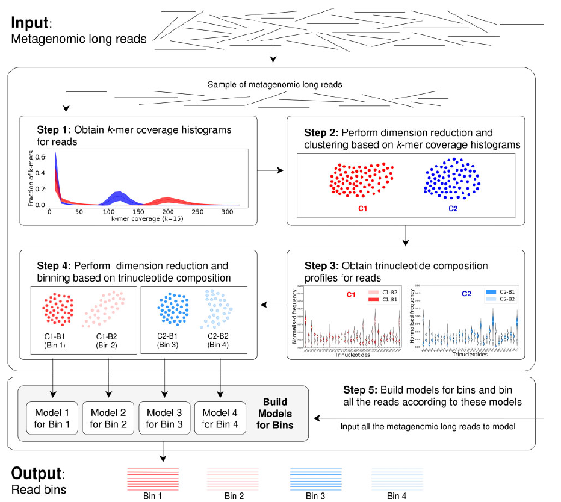
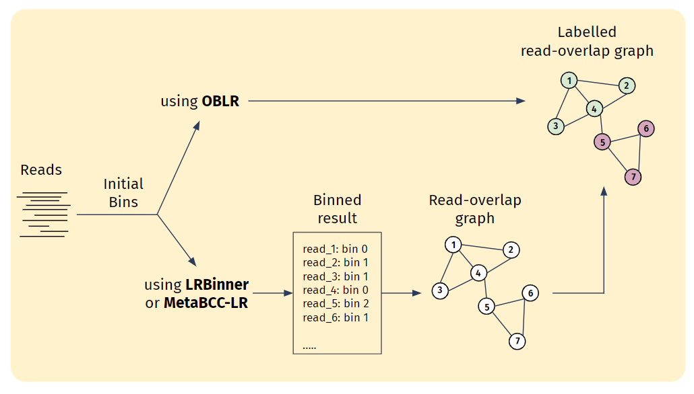
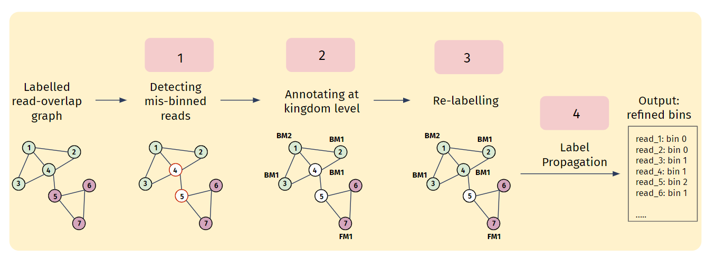

[comment]: # "This is the standard layout for the project, but you can clean this and use your own template"

# Long-reads Binning For Microbial Metagenomics Considering Multi-kingdoms

#### Team

- E/18/030, Aththanayaka A.M.S., [e18030@pdn.ac.lk](mailto:name@email.com)
- E/18/282, Ranasinghe R.A.N.S., [e18282@pdn.ac.lk](mailto:name@email.com)
- E/18/283, Ranasinghe R.D.J.M., [e18283@pdn.ac.lk](mailto:name@email.com)

#### Supervisors

- Dr. Damayanthi Herath, [damayanthiherath@eng.pdn.ac.lk](mailto:name@eng.pdn.ac.lk)
- Dr. Vijini Mallawarachchi, [vijini.mallawaarachchi@flinders.edu.au](mailto:name@eng.pdn.ac.lk)

#### Table of content

1. [Abstract](#abstract)
2. [Background](#background)
3. [Related works](#related-works)
4. [Methodology](#methodology)
5. [Experiment Setup and Implementation](#experiment-setup-and-implementation)
6. [Results and Analysis](#results-and-analysis)
7. [Conclusion](#conclusion)
8. [Publications](#publications)
9. [Links](#links)

## Abstract

DNA metagenomics, which analyzes the entire genetic pool of an environmental sample, offers powerful insights into microbial communities. Traditionally, short-read sequencing technology dominated metagenomic analysis. As sequencing technology advanced, long-read sequencing emerged, generating significantly longer reads. Then several binning tools have developed enabling reconstruction of more complete genomes. Most of these tools have used coverage and composition features for binning procedure and have achieved good accuracy. 

This research introduces GraphK-LR Refiner, a novel long-read binning refiner designed to address further additional read features like kingdom level information of microorganisms to enhance the accuracy and work along with long read binning tools like OBLR, MetaBCC-LR. By incorporating these advancements, GraphK-LR aims to significantly improve the accuracy and efficiency of binning long-reads by using multi-kingdom data. 

## Background 

  

Every living organism, from towering trees to microscopic bacteria, is built from fundamental units called cells. These microscopic marvels serve a dual purpose: providing structure and carrying out the essential chemical reactions that sustain life. Tucked away within the cell's nucleus lies the blueprint for the entire organism – its genome. This blueprint dictates everything from physical appearance to specialized functions. The code is stored on thread-like structures called chromosomes, made of DNA. DNA looks like a twisted ladder with four rungs labeled A, C, G, and T. The order of these rungs is the code itself, telling the cell how to make proteins, the workers that do all the cell's jobs. Genes are sections of the code with instructions for building specific proteins.

This is where DNA sequencing comes into play. DNA sequencing is a powerful technique that allows scientists to determine the exact order of the building blocks (nucleotides) that make up an organism's DNA. This sequence, often referred to as the genetic code, is like an instruction manual containing the blueprint for life. By analyzing the DNA sequence of microbes, scientists can gain valuable insights into their diversity, function and evolution.

However, DNA sequencing alone often results in a massive amount of fragmented data from various organisms within a sample. This is where binning comes in. Binning is a computational technique used to group these fragmented DNA sequences (often called reads) back together based on their similarity.

## Related works

<b>Early long-reads Binning Tools </b>
Megan-LR stands out as one of the earliest tools, employing a reference database. Megan-LR utilizes a protein-alignment-based approach and introduces two algorithms; one for taxonomic binning (based on Lowest Common Ancestor) and another for functional binning (based on an Interval-tree algorithm).

Two other noteworthy reference-independent tools, MetaProb and BusyBee Web, significantly contributed to the domain of unsupervised metagenomic binning. BusyBee Web, in particular, includes a web-based interface, offering additional visual insights into the binning process. However, despite their respective strengths, both MetaProb and BusyBee Web faced challenges related to scalability as input dataset sizes increased, impeding their ability to bin entire datasets in a single iteration.

<b>MetaBCC-LR </b>
MetaBCC-LR, a reference-free binning tool, utilizes composition and coverage as read features, relying on trinucleotide frequency vectors for composition and k-mer coverage histograms for coverage. The tool initially clusters reads based on coverage information, which will be re-clustered using composition information. 
Only a sample of reads is utilized for this process, contributing to computational efficiency. At the final stage, it creates statistical models for each cluster and bin the remaining reads. Despite its high accuracy, it may suffer from potential misclassification issues, particularly for low-abundance species, as well as the need for subsampling large datasets.

 

<b>LRBinner </b>
LRBinner adopts an innovative approach to reference-free binning by concurrently computing composition and coverage information for the entire dataset. It merges these features through a variational autoencoder, eliminating the need for subsampling and improving overall binning accuracy. It uses tetranucleotide frequency vectors for composition and k-mer coverage vectors as coverage information of reads. However, the tool faces challenges in distinguishing long reads from similar regions shared between different species.

 

<b>OBLR </b>
OBLR introduces a novel strategy in reference-free binning, leveraging read overlap graphs to estimate coverages and improve binning outcomes. It then employs the HDBSCAN hierarchical density-based clustering algorithm for read clustering. Additionally, it uses a sample of reads for initial clustering sampled using a probabilistic downsampling strategy. This results in clusters with similar sizes and fewer isolated points. OBLR then utilizes inductive learning with the GraphSAGE neural network architecture to assign bins to remaining reads.

 

## Proposed Work
We have identified the following as the challenges in existing tools.

- Mainly focus on composition and coverage as primary features. However, marker genes-based kingdom-level information can enhance the binning process.

- Existing long reads binning tools overlook differential abundance in multiple samples. Considering species abundance across samples could enhance binning accuracy.

- Lack of binning refinements for long reads binning tools. Introducing refining mechanisms could improve the precision of bin assignments.

Therefore, this project aims to develop a method to bin long reads from multiple metagenomic samples while being aware of the underlying microbial kingdoms. Specifically, it will be a Python-based command-line tool addressing the scalability issues with massive datasets.

## Methodology

Our methodology comprises two main stages: preprocessing and refining.

### Preprocessing

In the preprocessing stage, our focus lies in the generation of a read overlap graph utilizing established tools. The employment of read overlap graphs is paramount due to their capacity to integrate overlapping information between reads into the binning process. This integration not only enhances the accuracy of binning but also streamlines the identification of mis-binned reads, a critical aspect of refining binning outcomes. Among the tools available, OBLR stands out as a solution capable of seamlessly generating a read overlap graph as an integral part of its binning process. However, for alternative tools such as LRBinner or MetaBCC-LR, the generation of overlap graphs becomes the primary undertaking within the preprocessing phase.

### Refining

The refining stage involves several steps aimed at enhancing the quality of bins obtained from preprocessing.

  
- Initially, the output from preprocessing, i.e., the read overlap graph, is utilized to identify mis-binned reads. Mis-binned reads, located at the borders of bins, are prone to being incorrectly binned due to their ambiguous nature.

- Following the initial identification step, all reads within the dataset undergo annotation based on kingdom-level taxonomy, encompassing prokaryotes (Bacteria, Archaea), eukaryotes (Protists, Fungi), and viruses. Prokaryotes and eukaryotes are discerned utilizing kingdom-specific single-copy marker genes, whereas viruses are distinguished through orthologous gene groups sourced from VOG (Viral Orthologous Groups) and PHROG (Phage and Virus Orthologous Groups) databases.  This annotation process provides crucial insights into the taxonomic composition of reads. 

- Mis-binned reads are subsequently relabeled based on their allocated marker genes. If a read cannot be confidently relabeled, it is retained as ambiguous for resolution in subsequent steps. This iterative refinement process ensures that bins are accurately labeled.

- The final step involves label propagation, aiming to relabel all remaining ambiguous reads. This process utilizes a Graph Neural Network (GNN) that considers both composition and coverage information of reads. By leveraging advanced machine learning techniques, we can effectively resolve ambiguous assignments and produce refined bins.

Through these comprehensive steps, our methodology enables the generation of refined bins that consider their kingdom-level information, reflecting the diverse biological entities present in the dataset.

## Experiment Setup and Implementation

This section details the data used in experiments and tools employed in the overall workflow of the implementation.

#### Data
##### Testing Binning Tool Functionality
The simLoRD read simulator was used to generate datasets containing diverse kingdom-level microorganisms for initial testing of binning tool functionality. Mock community reference sequences were employed in this process.

##### Current Experimental Setup
The current experimental setup utilizes datasets from two chemistries: R9.4 (older long reads) and R10.4 (latest, most accurate long reads). R10.4 data is primarily used due to its superior read accuracy.

Examples:
- SRR9328980 (includes Bacteria and Eukaryota)
- ERR97765782 (includes Bacteria, Archaea, Eukaryota, and Viruses)

##### Marker Genes
Marker genes are specific DNA or protein sequences that indicate the presence of a particular organism or functional group. The information for these marker genes is stored in hidden Markov model files (.hmm files).  Currently, a combined database containing 38,991 marker genes related to bacteria, fungi, protists, and viruses is used for analysis.

#### Tools
- Sec2covvec - To get the Kmer coverage profiles
- Prodigal - To predict protein-coding sequences from reads.
- HMMER - To scan marker genes within protein-coded sequences
- Minimap - To get the mapping between reads and the actual species bin they belong

#### Implementation: GraphK-LR Refiner
A metagenomic binning refinement tool for long reads, which can be used in conjunction with long-read binning tools such as OBLR, MetaBCC-LR, and others. This refinement tool considers information at the microorganism kingdom level during the refinement process and utilizes a read-overlap graph approach. The tool is being finalized as a Python-based command-line tool.

## Results and Analysis

| Dataset    | Tool         | Precision(%) | Recall(%)   | F1-score(%)   | ARI(%)      |
|------------|--------------|--------------|-------------|---------------|-------------|
|SRR9328980  | OBLR         | 97.96        | 97.46       | 97.71         | 97.63       |
|            | GraphK-LR    | 98.44        | 97.91       | 98.17         | 98.19       |
|            |              |              |             |               |             |
|ERR97765782 | OBLR         | 63.81        | 77.77       | 70.10         | 52.01       |
|            | GraphK-LR    | 64.65        | 79.08       | 71.14         | 53.11       |
|            |              |              |             |               |             |
|            | LRBinner     | 50.35        | 87.73       | 63.98         | 44.48       |
|            | GraphK-LR    | 50.58        | 88.10       | 64.26         | 45.02       |

## Conclusion

## Publications
[//]: # "Note: Uncomment each once you uploaded the files to the repository"

1. [Semester 7 report](./documents/ReviewPaper.pdf)
2. [Semester 7 slides](./documents/Proposal-Presentation.pdf)
<!-- 3. [Semester 8 report](./) -->
<!-- 4. [Semester 8 slides](./) -->
<!-- 5. Author 1, Author 2 and Author 3 "Research paper title" (2021). [PDF](./). -->

## References

[1] Wickramarachchi, A., Mallawaarachchi, V., Rajan, V., & Lin, Y. (2020). MetaBCC-LR: metagenomics binning by coverage and composition for long reads. Bioinformatics (Oxford, England), 36(Suppl_1), i3–i11. https://doi.org/10.1093/bioinformatics/btaa441

[2] Wickramarachchi, A., & Lin, Y. (2022). Binning long reads in metagenomics datasets using composition and coverage information. Algorithms for molecular biology : AMB, 17(1), 14. https://doi.org/10.1186/s13015-022-00221-z 

[3] Wickramarachchi, A., & Lin, Y. (2022, May). Metagenomics binning of long reads using read-overlap graphs. In RECOMB International Workshop on Comparative Genomics (pp. 260-278). Cham: Springer International Publishing.

## Links

[//]: # ( NOTE: EDIT THIS LINKS WITH YOUR REPO DETAILS )

- [Project Repository](https://github.com/cepdnaclk/e18-4yp-Multi-Kingdom-Binning-of-Long-Read-Metagenomes)
- [Project Page](https://cepdnaclk.github.io/e18-4yp-Multi-Kingdom-Binning-of-Long-Read-Metagenomes)
- [Department of Computer Engineering](http://www.ce.pdn.ac.lk/)
- [University of Peradeniya](https://eng.pdn.ac.lk/)

[//]: # "Please refer this to learn more about Markdown syntax"
[//]: # "https://github.com/adam-p/markdown-here/wiki/Markdown-Cheatsheet"
